<h1 align="center"> BRENO-OKRA FOOD EXPLORER V2 - ROCKETSEAT EXPLORER - FINAL CHALENGE
</h1>

    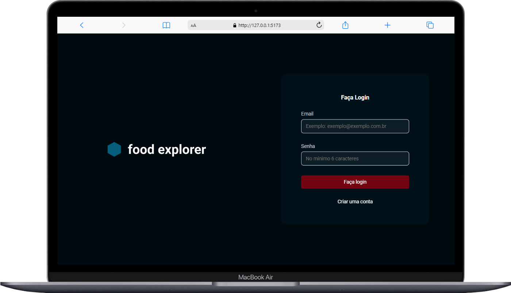
 

- code backend: https://github.com/Breno-oKra/Food_explorerv2
- site deployed : https://food-explorer-brenookra.netlify.app/

## UTILS
user_adm: mabel@gmail.com
senha: 123

user_adm2: fabi@gmail.com
senha: 123

user_customer: breno@gamil.com
senha: 123

## 🚀 Techniques

this project was developed with technology:

- REACTJS E VITE
- STYLED-COMPONENTS
- AXIOS
- COOKIES

## learning main

- cookies
- routers

## about

this is the final project of the rocketseat explorer course, the site has the purpose of replicating some concepts used in ifood and covers many configurations for learning

## 💻 Photos Project

    <h3>Home customer</h3>
    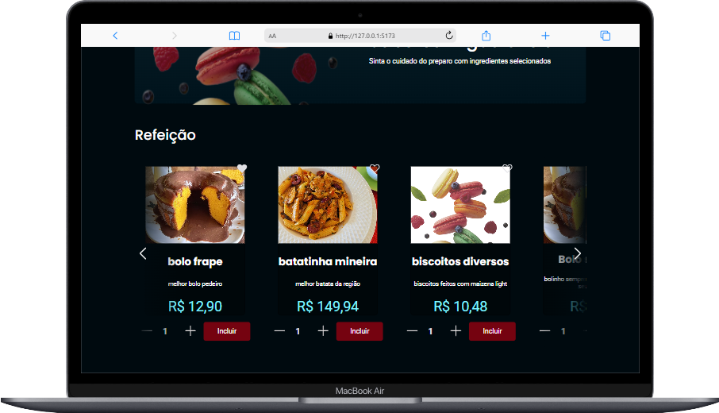
    <h3>Homer Admin</h3>
    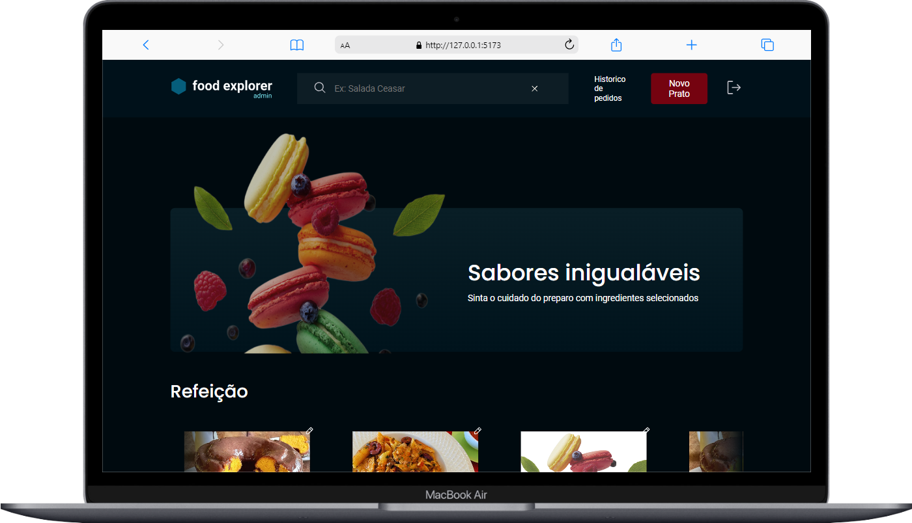
      <h3>details</h3>
    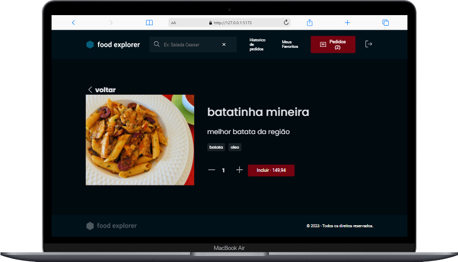
      <h3>details adm</h3>
    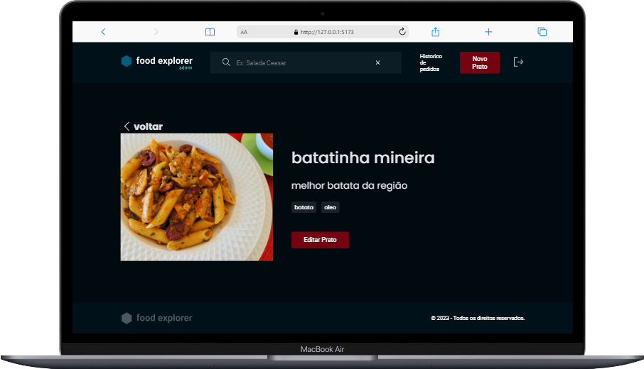
       <h3>historic adm</h3>
    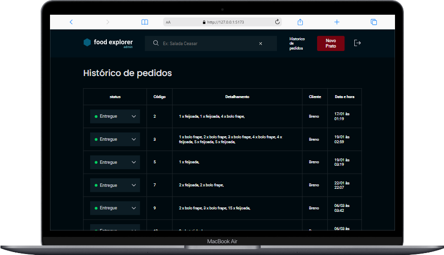
         <h3>payment</h3>
    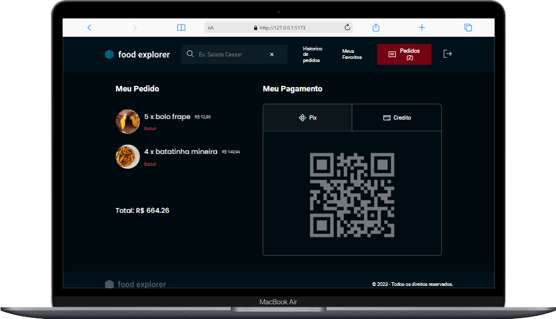  

    

     
  <h3>Home Mobile</h3>
        

    

        
  <h3>Home Mobile</h3>
        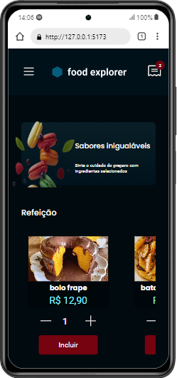

         
 
            <h3>Home Mobile Admin</h3>
            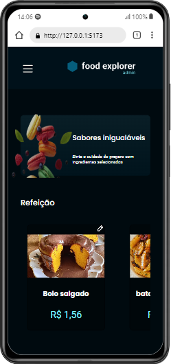
        
  
        
 
            <h3>Details Mobile</h3>
            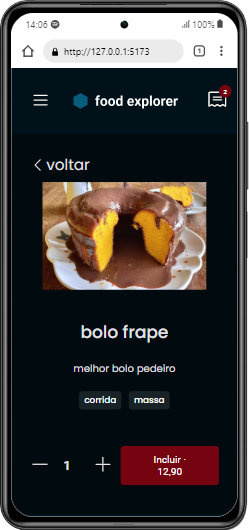
        
 
         
 
            <h3>Details Mobile adm</h3>
            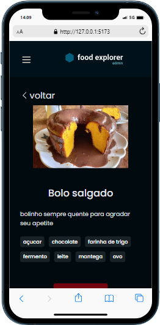
        
  
         
 
            <h3>Menu Mobile</h3>
            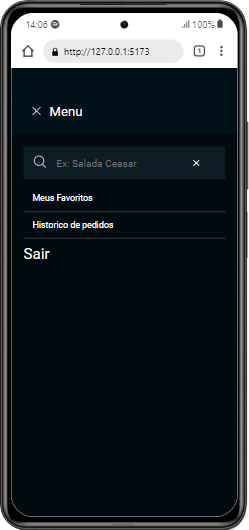
        
  
          
 
            <h3>Menu Mobile adm</h3>
            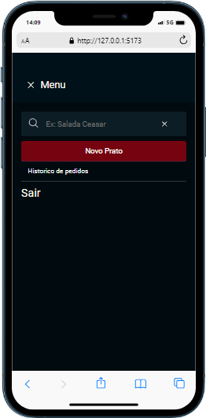
        
  
        
 
            <h3>historic mobile</h3>
            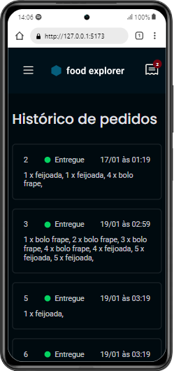
        

         
 
            <h3>historic mobile adm</h3>
            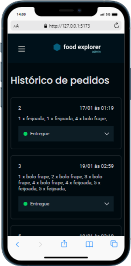
        

        
 
            <h3>pay</h3>
            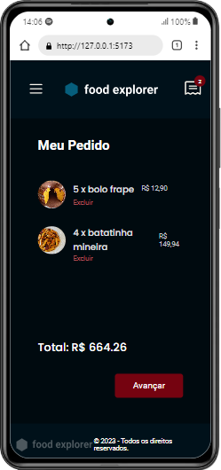
        

      

# React + Vite

This template provides a minimal setup to get React working in Vite with HMR and some ESLint rules.

Currently, two official plugins are available:

- [@vitejs/plugin-react](https://github.com/vitejs/vite-plugin-react/blob/main/packages/plugin-react/README.md) uses [Babel](https://babeljs.io/) for Fast Refresh
- [@vitejs/plugin-react-swc](https://github.com/vitejs/vite-plugin-react-swc) uses [SWC](https://swc.rs/) for Fast Refresh
